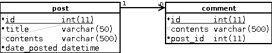

## Make database diagrams in DIA automatically

I’ve written a utility in Python that reads an SQL schema and outputs a DIA file for it. As of now it is not designed to handle relations between tables. I have used it to create diagrams from SQL schemas written for MySQL. It should not be too hard to make it work with other database systems by changing the parsing code. The parsing is accomplished with regular expressions, which may be a little confusing but it seems to work OK on most cases tested.

For example, let’s say we have the following SQL schema:

```sql
create table post (
  id int(11) not null,
  title varchar(50) not null,
  contents varchar(500),
  date_posted datetime not null,
  primary key (id)
);
create table comment (
  id int(11) not null,
  contents varchar(500),
  post_id int(11) not null,
  primary key(id)
);
```

The automatically generated diagram is the following (after fixing the layout of the tables and inserting a relation between the two tables):


